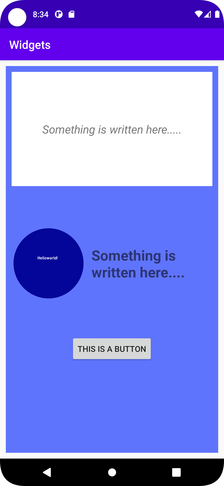

# Rapport

**Widget Labb**

En constraint layout som har en vit färg, den kommer agera som grund för resten av applikationen. Därför sätts des constraints längst med kanterna av applikationen. 
```
<androidx.constraintlayout.widget.ConstraintLayout>
//skapar en constraintlayout

```

Nya färg resources i colors.xml skapades, och kommer användas sedan.

```
<color name="veryLightBlue">#5F74FC</color>
<color name="white">#FFFFFF</color>
//varje rad är en ny lagrad färg med ett namn 
```
I constraint layouten som skapades innan skapas en LinearLayout med den blå färgen, denna kommer senare att innehålla resterande widgets. En generel margin angavs för att förminska storleken av den blå widgeten.
```
 <LinearLayout
            android:id="@+id/widget_window_Background"    // ger layouten ett ID
            
            android:layout_width="match_parent"
            android:layout_height="match_parent"          // gör så att layouten anpassar sig utifrån dess förälder 
            
            android:layout_margin="10dp"                   // alla kanter flyttas in 10dp
            android:background="@color/veryLightBlue"      // färgen som skapades innan används som bakgrund

            app:layout_constraintBottom_toBottomOf="parent"     //
            app:layout_constraintEnd_toEndOf="parent"           // sätter gränsen för innehållet 
            app:layout_constraintStart_toStartOf="parent"       //
            app:layout_constraintTop_toTopOf="parent">          //
  </LinearLayout>
 
```
Det skapdes sedan en TextView som placerades innanför LinearLayouten, I denna ruta skrev en liten kort textsträng som centrerades med hjälp av `android:gravity="center"` texten justerades sedan med hjälp av `android:textSize="" android:textStyle=""`.
Brädden för fönstret sattses efter dess förälder men med en generel magrin på 10dp för att ge den blå bakgrunden chansen att träda fram och sist ändrades bakgrundsfärgen till vit. 
```
<TextView
         android:id="@+id/text_window"
         android:layout_width="match_parent"
         android:layout_height="200dp"              // en fast storlek sätts
         android:background="@color/white"          
         android:layout_margin="10dp"               
         android:text="@string/write_somthing_here" // en sträng variabel hämtas och används
         android:textSize="20sp"                    // text storleken sätts till 20sp
         android:textStyle="italic"                 // textens font sätts till italic
         android:gravity="center"                   // texten centreras
         />
```
Ytterligare en LinearLayout skappades denna gång med en horisontel orientering, i den inforgades det en ImageView där en bild som placerats i mappen **drawable** användes samt en textView med en kort text sträng som plaserades bredvid med en centrering. 
```
   <LinearLayout
                android:layout_marginTop="50dp"         // layouten flyttas ned 50dp från den widget som ligger över den 
                android:orientation="horizontal"        // layouten byter till en horisontel orientering
                android:layout_width="wrap_content"     //
                android:layout_height="wrap_content">   // layouten använder enbart den plats den behöver och anpassar storleken till det.

                <ImageView
                    android:id="@+id/image"
                    android:layout_width="150dp"
                    android:layout_height="150dp"
                    android:src="@drawable/helloworld"   // en bild som placerats i mappen `drawable` används
                    />

                <TextView
                    android:layout_width="match_parent"
                    android:layout_height="wrap_content"
                    android:text="@string/a_bit_of_text"
                    android:textSize="25sp"
                    android:textStyle="bold"
                    android:layout_gravity="center"       // centrerar inehållet 
                    />

                </LinearLayout>
```
Den widget som implementerades sist var en knapp, som placerades centrerat, knappen infogades som sista element i det första LinearLayouten som skapades. 
```
                <Button
                    android:id="@+id/button"
                    android:text="@string/Button"
                    android:layout_width="wrap_content"
                    android:layout_height="wrap_content"
                    android:layout_marginTop="50dp"
                    android:layout_gravity="center_horizontal"
                />
```


